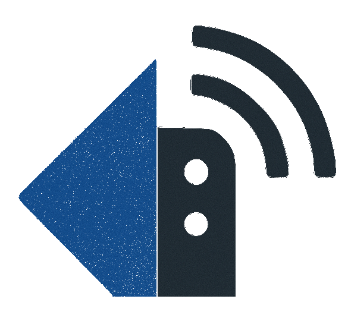

# Reacharr

<div align="center">
  
</div>
Connect your local Radarr and Sonarr instances to the Reacharr cloud platform for remote access, sharing, and automated content management.

> 🎉 **NEW**: Zero-configuration Docker deployment! No environment variables or Firebase setup required - just run and configure through the web UI.

## 🚀 What is Reacharr Local Agent?

The Reacharr Local Agent is a lightweight service that securely connects your local media servers (Radarr, Sonarr) to the Reacharr cloud platform. It enables:

- **Remote Access**: Control your media servers from anywhere
- **Content Sharing**: Share your collections with friends and family
- **Automated Management**: Let others request content that gets automatically added
- **Secure Communication**: All connections are encrypted and authenticated

## 📋 Prerequisites

Before installing the agent, ensure you have:

1. **Radarr and/or Sonarr** running locally
2. **Docker and Docker Compose** installed (for the recommended method)
3. **Reacharr account** ([Sign up here](https://reacharr.com))
4. **Network connectivity** to reacharr.com (port 1883 for MQTT)

> ℹ️ **Note**: Firebase credentials are no longer required! They're now built into the Docker images.

## 🐳 Installation Method 1: Docker (Recommended) - Zero Configuration!

Docker is the easiest way to run the Reacharr Local Agent. **No environment variables or Firebase setup required!**

### ⚡ Super Quick Start (2 minutes)

1. **Download the ready-to-run Docker setup:**
   ```bash
   curl -L https://github.com/KuyaPollio/ReacharrLocalAgent/releases/latest/download/docker-compose.yml -o docker-compose.yml
   ```

2. **Start the agent:**
   ```bash
   docker-compose up -d
   ```

3. **Configure through web UI:**
   - 🌐 Open **http://localhost:3001** in your browser
   - 🔧 Add your Radarr/Sonarr servers (URLs and API keys)
   - ✅ Complete the setup wizard

4. **You're done!** The agent automatically connects to Reacharr.com

### 📋 Complete Docker Compose File

If you prefer to copy-paste, here's the complete `docker-compose.yml`:

```yaml
version: '3.8'

services:
  # Reacharr Local Agent Backend
  reacharr-agent:
    image: ghcr.io/KuyaPollio/reacharr-localagent:latest
    container_name: reacharr-agent
    volumes:
      - ./data:/app/data
      - /var/run/docker.sock:/var/run/docker.sock:ro
    ports:
      - "3000:3000"
    networks:
      - reacharr-network
    restart: unless-stopped
    healthcheck:
      test: ["CMD", "node", "-e", "const http = require('http'); http.get('http://localhost:3000/health', (res) => process.exit(res.statusCode === 200 ? 0 : 1)).on('error', () => process.exit(1))"]
      interval: 30s
      timeout: 10s
      retries: 3
      start_period: 40s

  # Configuration Web UI
  reacharr-config-ui:
    image: ghcr.io/KuyaPollio/reacharr-configui:latest
    container_name: reacharr-config-ui
    environment:
      - REACT_APP_AGENT_API_URL=http://localhost:3000
    ports:
      - "3001:3000"
    networks:
      - reacharr-network
    restart: unless-stopped
    depends_on:
      reacharr-agent:
        condition: service_healthy

networks:
  reacharr-network:
    driver: bridge

volumes:
  reacharr_data:
```

### 🔧 Configuration Examples

#### Radarr/Sonarr on the same machine:
- **Radarr URL**: `http://host.docker.internal:7878`
- **Sonarr URL**: `http://host.docker.internal:8989`

#### Radarr/Sonarr in Docker containers:
- **Radarr URL**: `http://radarr:7878` (if on same network)
- **Sonarr URL**: `http://sonarr:8989`

#### Remote Radarr/Sonarr:
- **Radarr URL**: `http://192.168.1.100:7878` (use actual IP)
- **Sonarr URL**: `http://192.168.1.100:8989`

### 📊 Docker Management Commands

```bash
# View logs
docker-compose logs -f reacharr-agent

# Update to latest version
docker-compose pull && docker-compose up -d

# Restart services
docker-compose restart

# Stop everything
docker-compose down

# Complete reset (removes all data)
docker-compose down -v
rm -rf ./data

# Debug mode (check individual service logs)
docker-compose logs -f reacharr-config-ui
```

### 🐛 Troubleshooting

**Agent won't start?**
```bash
docker-compose logs reacharr-agent
```

**Can't access Radarr/Sonarr?**
- ✅ Check if they're running: `curl http://localhost:7878` 
- ✅ Try `host.docker.internal` instead of `localhost`
- ✅ Verify API keys in their web interfaces

**Configuration UI not loading?**
```bash
docker-compose logs reacharr-config-ui
```

### 📁 Data Storage

All configuration is stored in `./data/`:
- `./data/agent-config.json` - Your configuration
- `./data/agent.log` - Application logs

## 🐧 Installation Method 2: Native Linux/macOS

Install the agent directly on your Linux or macOS system as a native service.

### Automatic Installation

```bash
# One-line installer (requires sudo)
curl -sSL https://install.reacharr.com | sudo bash

# Or download and run manually
curl -L https://install.reacharr.com/install.sh -o install.sh
chmod +x install.sh
sudo ./install.sh
```

### Manual Installation

1. **Download the agent:**
   ```bash
   # For Linux
   curl -L https://github.com/reacharr/releases/latest/download/reacharr-agent-linux-v1.0.0.zip -o agent.zip
   
   # For macOS
   curl -L https://github.com/reacharr/releases/latest/download/reacharr-agent-macos-v1.0.0.zip -o agent.zip
   ```

2. **Extract and install:**
   ```bash
   sudo mkdir -p /opt/reacharr-agent
   sudo unzip agent.zip -d /opt/reacharr-agent
   sudo chmod +x /opt/reacharr-agent/*.sh
   sudo chmod +x /opt/reacharr-agent/reacharr-agent-*
   ```

3. **Configure the agent:**
   ```bash
   sudo cp /opt/reacharr-agent/.env.example /opt/reacharr-agent/.env
   sudo nano /opt/reacharr-agent/.env
   ```

4. **Add Firebase credentials:**
   ```bash
   # Copy your firebase-service-account.json to:
   sudo cp firebase-service-account.json /opt/reacharr-agent/
   ```

5. **Install as service:**
   
   **Linux (systemd):**
   ```bash
   sudo systemctl enable reacharr-agent
   sudo systemctl start reacharr-agent
   ```
   
   **macOS (launchd):**
   ```bash
   sudo launchctl load /Library/LaunchDaemons/com.reacharr.agent.plist
   ```

### Native Management Commands

Once installed, use the `reacharr-agent` command:

```bash
# Start the agent
reacharr-agent start

# Stop the agent
reacharr-agent stop

# Check status
reacharr-agent status

# View logs
reacharr-agent logs

# Edit configuration
reacharr-agent config
```

## 🪟 Installation Method 3: Windows

Install the agent on Windows as a native Windows service.

### Automatic Installation

1. **Download and run installer:**
   - Download [install-windows.ps1](https://install.reacharr.com/install-windows.ps1)
   - Right-click PowerShell and select "Run as Administrator"
   - Navigate to the download directory
   - Run: `.\install-windows.ps1`

### Manual Installation

1. **Download the agent:**
   ```powershell
   Invoke-WebRequest -Uri "https://github.com/reacharr/releases/latest/download/reacharr-agent-windows-v1.0.0.zip" -OutFile "agent.zip"
   ```

2. **Extract to Program Files:**
   ```powershell
   $installPath = "$env:ProgramFiles\Reacharr\Agent"
   New-Item -ItemType Directory -Path $installPath -Force
   Expand-Archive -Path "agent.zip" -DestinationPath $installPath -Force
   ```

3. **Configure the agent:**
   ```powershell
   Copy-Item "$installPath\.env.example" "$installPath\.env"
   notepad "$installPath\.env"
   ```

4. **Add Firebase credentials:**
   - Copy `firebase-service-account.json` to `$installPath\firebase-service-account.json`

5. **Install as Windows Service:**
   ```powershell
   # Install service
   sc.exe create ReacharrAgent binPath= "$installPath\reacharr-agent-windows.exe" start= auto
   sc.exe description ReacharrAgent "Reacharr Local Agent"
   
   # Start service
   Start-Service ReacharrAgent
   ```

### Windows Management

```powershell
# Start service
Start-Service ReacharrAgent

# Stop service
Stop-Service ReacharrAgent

# Check status
Get-Service ReacharrAgent

# View logs
Get-EventLog -LogName Application -Source "Reacharr Agent" -Newest 50
```

## ⚙️ Configuration

### Environment Variables

The agent uses environment variables for configuration. Edit your `.env` file:

```env
# Remote Server Configuration
REMOTE_SERVER_URL=https://reacharr.com
MQTT_BROKER_URL=mqtt://reacharr.com:1883
MQTT_PASSWORD=reacharr_agent_password

# Application Settings
NODE_ENV=production
LOG_LEVEL=info
PORT=3000

# Local Service URLs (will be configured via web UI)
RADARR_URL=http://localhost:7878
RADARR_API_KEY=your_api_key_here
SONARR_URL=http://localhost:8989
SONARR_API_KEY=your_api_key_here

# Firebase Configuration
FIREBASE_PROJECT_ID=managarr-7c808
FIREBASE_SERVICE_ACCOUNT_PATH=./firebase-service-account.json

# Sync Settings
SYNC_INTERVAL=30000
RETRY_ATTEMPTS=3
RETRY_DELAY=5000
```

### Firebase Setup

1. **Create Firebase Project** (if you don't have one):
   - Go to [Firebase Console](https://console.firebase.google.com)
   - Create a new project or use existing
   - Enable Authentication with Google provider

2. **Get Service Account Key:**
   - Go to Project Settings > Service Accounts
   - Click "Generate new private key"
   - Save as `firebase-service-account.json`

3. **Get Web Config:**
   - Go to Project Settings > General
   - In "Your apps" section, create a web app
   - Copy the config object
   - Save as `frontend/firebase-config.json`

### Web UI Configuration

After starting the agent, access the web UI at http://localhost:3001 to:

1. **Authenticate with Firebase** - Sign in with your Google account
2. **Configure Radarr** - Add your Radarr server URL and API key
3. **Configure Sonarr** - Add your Sonarr server URL and API key
4. **Register Agent** - Connect your agent to the Reacharr cloud
5. **Test Connection** - Verify everything is working

## 🛠️ Troubleshooting

### Common Issues

#### Agent Won't Start
```bash
# Check logs for errors
docker-compose logs reacharr-agent  # Docker
reacharr-agent logs                 # Native
Get-EventLog -LogName Application -Source "Reacharr Agent"  # Windows

# Common fixes:
# - Verify Firebase credentials are correct
# - Check network connectivity to reacharr.com:1883
# - Ensure port 3000 is not in use
```

#### Can't Connect to Radarr/Sonarr
```bash
# Verify URLs and API keys in configuration
# Test connectivity manually:
curl http://localhost:7878/api/v3/system/status?apikey=YOUR_API_KEY

# Docker networking issues:
# - Use container names if services are in Docker
# - Use host.docker.internal for host services
# - Verify Docker network configuration
```

#### MQTT Connection Failed
```bash
# Check if MQTT port is accessible:
telnet reacharr.com 1883

# Verify environment variables:
echo $MQTT_BROKER_URL
echo $REMOTE_SERVER_URL

# Check firewall settings
```

#### Permission Errors (Docker)
```bash
# Fix volume permissions:
sudo chown -R 1001:1001 ./data
```

#### Agent ID Format Issues
```bash
# If you see 400 errors about agent ID format:
# Delete the old configuration to force re-registration:
rm ./data/agent-config.json  # Docker
sudo rm /opt/reacharr-agent/agent-config.json  # Native
```

### Debug Mode

Enable debug logging for more detailed information:

**Docker:**
```bash
echo "LOG_LEVEL=debug" >> .env
docker-compose up -d
docker-compose logs -f reacharr-agent
```

**Native:**
```bash
sudo sed -i 's/LOG_LEVEL=info/LOG_LEVEL=debug/' /opt/reacharr-agent/.env
reacharr-agent start
reacharr-agent logs
```

**Windows:**
```powershell
(Get-Content "$env:ProgramFiles\Reacharr\Agent\.env") -replace 'LOG_LEVEL=info', 'LOG_LEVEL=debug' | Set-Content "$env:ProgramFiles\Reacharr\Agent\.env"
Restart-Service ReacharrAgent
```

## 🔒 Security

- All communication with Reacharr servers is encrypted (HTTPS/WSS)
- Firebase authentication ensures only authorized users can access your agent
- API keys are stored locally and never transmitted to Reacharr servers
- The agent runs as a non-privileged user
- No inbound connections are required (agent initiates all connections)

## 📚 Documentation

- **Discord Support**: https://discord.gg/reacharr
- **GitHub Issues**: https://github.com/reacharr/local-agent/issues

## 🔄 Updates

### Docker
```bash
docker-compose pull
docker-compose up -d
```

### Native (Linux/macOS)
```bash
curl -sSL https://install.reacharr.com | sudo bash
```

### Windows
Re-run the PowerShell installer script.

## 📄 License

MIT License - see [LICENSE](LICENSE) file for details.

## 🤝 Contributing

We welcome contributions! Please see our [Contributing Guide](CONTRIBUTING.md) for details.

---

**Questions?** Join our [Discord community](https://discord.gg/reacharr) or [open an issue](https://github.com/reacharr/local-agent/issues). 